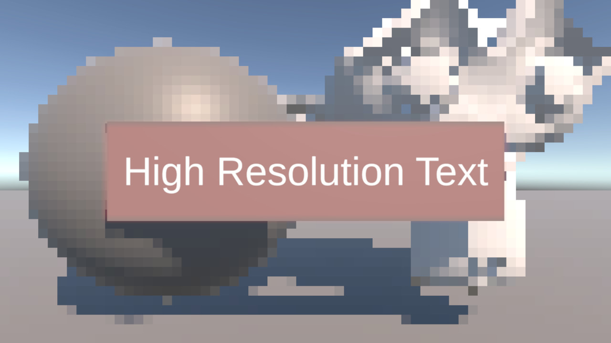

# Unity URP Selective Render Scale Feature

* Version: Unity Editor 2022.3.62f3 

* Status: Experimental / Working Prototype

* Open project, select scene SampleScene

Selective Render Scale is an experimental ScriptableRendererFeature for Unity 2022 URP. The goal of the system is to reduce GPU pixel shading cost by rendering selected world objects at a lower resolution, while keeping important elements such as UI, TextMeshPro text, and other objects outside the low-resolution layer at the camera's native render resolution. Objects assigned to a dedicated layer, for example RenderScale, are excluded from the standard URP Opaque and Transparent Layer Masks and are rendered separately into lower-resolution render targets. The result is then upscaled and composited back into the main camera target. This approach is particularly useful in standalone VR, where fragment shading and fill rate can be significant GPU bottlenecks. Rendering large portions of the environment at a reduced resolution can lower the number of expensive fragment shader executions, while preserving sharp and readable UI.

